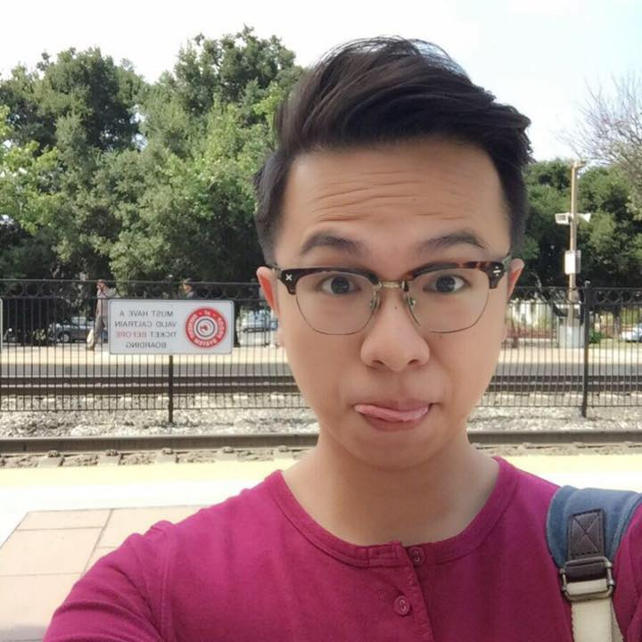

# About Us

We are a team based in the [School of Computing, National University of Singapore](http://www.comp.nus.edu.sg).

## Project Team

#### [Lim Jing Rong](http://jjingrong.com) [@jjingrong](http://github.com/jjingrong)
 

* Components in charge of: [Parsing](https://github.com/CS2103JAN2017-F12-B2/main/blob/master/docs/DeveloperGuide.md#parsing-component)
[RecurrentTasks](https://github.com/CS2103JAN2017-F12-B2/main/blob/master/docs/DeveloperGuide.md#recurrenttasks)
* Aspects/tools in charge of: Git, Project Management, Issue tracking, all CI, Testing, Checkstyles, Weekly Sanity Checks
* Features implemented:
   * [Undo/Redo](https://github.com/CS2103JAN2017-F12-B2/main/blob/master/docs/UserGuide.md#undo)
   * [Edit](https://github.com/se-edu/CS2103JAN2017-F12-B2/main/blob/master/docs/UserGuide.md#edit)
   * [Rich Parsing](https://github.com/CS2103JAN2017-F12-B2/main/blob/master/docs/UserGuide.md#add)
   * [Recurring tasks](https://github.com/CS2103JAN2017-F12-B2/main/blob/master/docs/UserGuide.md#add)

* Code written: [[Functional Code](https://github.com/CS2103JAN2017-F12-B2/main/blob/master/collated/main/A0114395E.md)][[test code](https://github.com/CS2103JAN2017-F12-B2/main/blob/master/collated/test/A0114395E.md)]
* Other major contributions:
  * Set up Travis, Coveralls, Codacy, Appveyor.
  * Added libraries for Date Parsing
  * Fixed the initial refactoring for Find/Edit commands
  * Fixed most initial checkstyle issues during refactor
  * Tagging and write-up for releases every week
  * Tagging and write-up for all pre-releases
  * Changed color scheme of the application

----

#### [Lim Huan Hock @huanhock](http://github.com/huanhock)
 

* Components in charge of: [Model](https://github.com/CS2103JAN2017-F12-B2/main/blob/master/docs/DeveloperGuide.md#)
* Aspects/tools in charge of: Git, Project Management, Issue tracking, CI
* Features implemented:
   * [Mark/Unmark](https://github.com/CS2103JAN2017-F12-B2/main/blob/master/docs/UserGuide.md#mark)
   * [Finding by start, deadline, priority, completion](https://github.com/se-edu/addressbook-level4/blob/master/docs/UserGuide.md#find)
   * [Specify Path](https://github.com/se-edu/addressbook-level4/blob/master/docs/UserGuide.md#specifypath)
<!-- todo code written -->
* Code written: [[Functional Code](https://github.com/CS2103JAN2017-F12-B2/main/blob/master/collated/main/A0124591H.md)][[Test Code](https://github.com/CS2103JAN2017-F12-B2/main/blob/master/collated/test/A0124591H.md)]
* Other major contributions:
  * Overhauled and adapted whole of AddressBook into ToDoApp

----

#### [Wong Woon Fui @benwongwf](http://github.com/benwongwf)
 

* Components in charge of:
* Aspects/tools in charge of: Testing
* Features implemented:
<!-- todo code written -->
* Code written: [[Functional Code](https://github.com/CS2103JAN2017-F12-B2/main/blob/master/collated/main/A0124153U.md)][[Test Code](https://github.com/CS2103JAN2017-F12-B2/main/blob/master/collated/test/A0124153U.md)]
* Other major contributions:
  * Collate tool

-----

# Contributors

We welcome contributions. See [Contact Us](ContactUs.md) page for more info.

* [Lim Jing Rong](https://github.com/CS2103AUG2016-F12-B2/main/pulls?q=is%3Apr+author%3Ajjingrong)
* [Lim Huan Hock](https://github.com/CS2103AUG2016-F12-B2/main/pulls?q=is%3Apr+author%3Ahuanhock)
* [Wong Woon Fui](https://github.com/CS2103AUG2016-F12-B2/main/pulls?q=is%3Apr+author%3Abenwongwf)
